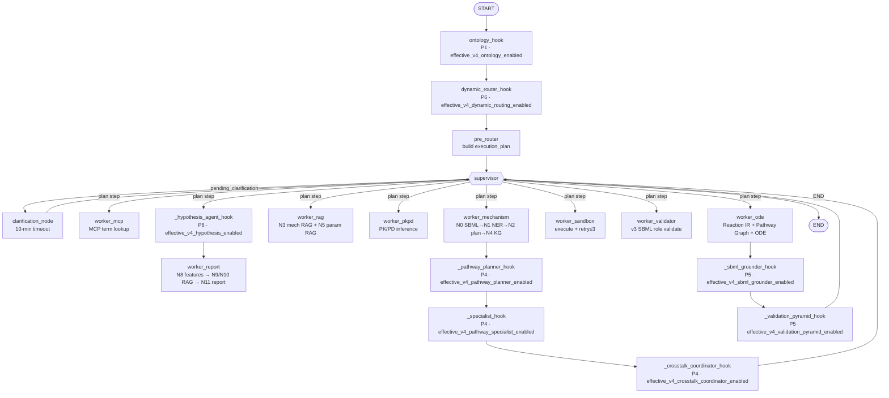

# BioDynamics Agent v4 RC — Architecture

> Task F.1 (batch 1) — documentation only. Source of truth:
> `backend/app/graph_v3.py`, `backend/app/state.py`, `backend/app/config.py`,
> `backend/app/main.py`.

This document covers: (1) backend architecture diagram, (2) v4 module matrix
(Phase 1–6 → module → node → flag), (3) v4 state container structure, (4)
feature-flag hierarchy (3 coarse → 13 fine), (5) LangGraph workflow node
sequence, (6) SSE event flow (backend → frontend).

---

## 1. Backend Architecture Diagram



Solid edges are unconditional (v3 spine). Dashed/boxed nodes are v4 hooks —
each returns `{}` when its effective flag is `false`, so the edge is
equivalent to a direct connection to `supervisor`.

---

## 2. v4 Module Matrix (Phase → Module → Node → Flag)

| Phase | Module (path) | LangGraph node | Effective flag (settings method) |
|---|---|---|---|
| **P1 Ontology** | `app/ontology/ontology_agent.py` | `ontology_hook` | `effective_v4_ontology_enabled()` |
| **P2 Reaction IR** | `app/reaction_ir_v2/` + `app/adapters/` | inside `worker_ode` (`_reaction_ir_v2_hook`) | `effective_v4_reaction_ir_enabled()` |
| **P2 Adapter** | `app/adapters/v3_v4_adapter.py`, `v4_v3_adapter.py` | inside `worker_ode` | `effective_v4_reaction_ir_adapter_enabled()` |
| **P3 Pathway Graph** | `app/pathway_graph/builder.py`, `initializer.py` | inside `worker_ode` (`_pathway_graph_hook`) | `effective_v4_pathway_graph_enabled()` |
| **P3 ODE Template v2** | `app/ode_renderer_v2.py` + `app/ode_templates_v2/*.j2` | inside `worker_ode` (`_ode_template_v2_hook`) | `effective_v4_ode_template_v2_enabled()` |
| **P4 Pathway Planner** | `app/pathways/pathway_planner.py` | `_pathway_planner_hook` (after `worker_mechanism`) | `effective_v4_pathway_planner_enabled()` |
| **P4 Specialist (×10)** | `app/pathways/specialists/*_specialist.py` | `_specialist_hook` | `effective_v4_pathway_specialist_enabled()` |
| **P4 Cross-talk Coord.** | `app/crosstalk/coordinator.py`, `shared_species_sync.py`, `time_scale_aligner.py` | `_crosstalk_coordinator_hook` | `effective_v4_crosstalk_coordinator_enabled()` |
| **P5 SBML Grounder** | `app/sbml_grounder/grounder_agent.py`, `five_level_mapping.py`, `sbml_parser_v2.py` | `_sbml_grounder_hook` (after `worker_ode`) | `effective_v4_sbml_grounder_enabled()` |
| **P5 Validation Pyramid** | `app/validation_v2/validation_agent.py` + `level1_internal.py` … `level5_hypothesis.py` + `thresholds.py` | `_validation_pyramid_hook` | `effective_v4_validation_pyramid_enabled()` |
| **P5 Calibration Agent** | `app/calibration/calibration_agent.py`, `least_squares_fitter.py`, `confidence_interval.py` | (called by Validation Pyramid L4 hook) | `effective_v4_calibration_agent_enabled()` |
| **P5 Sensitivity** | `app/sensitivity/sensitivity_analyzer.py`, `local_sensitivity.py`, `sobol_analyzer.py`, `morris_analyzer.py` | (called by Calibration hook) | `effective_v4_calibration_agent_enabled()` (shared) |
| **P6 Hypothesis Agent** | `app/hypothesis/hypothesis_agent.py`, `hypothesis_generator.py`, `falsifiability_checker.py`, `experiment_designer.py`, `parameter_explorer.py`, `sensitivity_planner.py` | `_hypothesis_agent_hook` (before `worker_report`) | `effective_v4_hypothesis_enabled()` |
| **P6 Dynamic Router** | `app/agent_orchestration/dynamic_router.py`, `agent_registry_v4.py`, `pathway_class_dispatcher.py`, `fail_safe.py` | `_dynamic_router_hook` (after `ontology_hook`) | `effective_v4_dynamic_routing_enabled()` |
| **P6 13-Agent Builders** | `app/agents_v4/mechanism_builder.py`, `ode_builder.py`, `parameter_agent.py`, `simulation_planner.py` | dispatched by Dynamic Router | (gated by `effective_v4_dynamic_routing_enabled()`) |

All hook nodes live in `graph_v3.py::build_workflow_v3()` and were added
**non-invasively** — no v3 worker function was modified; flags-off behavior
equals v3 bit-for-bit.

---

## 3. State Management — v4_state Container (Task B.2)

LangGraph state is defined in `app/state.py::BioDynamicsState` (TypedDict,
`total=False`). v4 added 17 flat `v4_*` fields plus a unified `v4_state`
container with a custom reducer.

### 3.1 The 17 v4 flat fields and their group/key mapping

`V4_FIELD_MAP` in `state.py` maps each flat field to `(group, key)`:

| Phase group | Flat field | Key |
|---|---|---|
| `ontology` | `v4_ontology_entities` | `entities` |
| `reaction_ir` | `v4_reaction_ir` | `ir` |
| `pathway_graph` | `v4_pathway_graph` | `graph` |
| `pathway_graph` | `v4_ode_system` | `ode_system` |
| `pathway_class` | `v4_pathway_class` | `class` |
| `specialist` | `v4_specialist_outputs` | `outputs` |
| `specialist` | `v4_crosstalk_edges` | `crosstalk_edges` |
| `specialist` | `v4_shared_species` | `shared_species` |
| `specialist` | `v4_shared_species_sync` | `shared_species_sync` |
| `specialist` | `v4_time_scale_alignment` | `time_scale_alignment` |
| `grounding` | `v4_grounding_ledger` | `ledger` |
| `validation` | `v4_validation_report` | `report` |
| `validation` | `v4_calibration_result` | `calibration_result` |
| `validation` | `v4_sensitivity_report` | `sensitivity_report` |
| `hypothesis` | `v4_hypothesis_list` | `list` |
| `hypothesis` | `v4_hypothesis_generated` | `generated` |
| `router` | `v4_agent_dispatches` | `dispatches` |

### 3.2 Container shape

```python
state["v4_state"] = {
    "ontology":     {"entities": <dict>},
    "reaction_ir":  {"ir": <ReactionIRv2.model_dump()>},
    "pathway_graph":{"graph": <PathwayGraph.model_dump()>,
                     "ode_system": {"pathway_class","template_name","ode_code",
                                    "temporal","dde_info","version"}},
    "pathway_class":{"class": "EGFR_RTK" | "MULTI:EGFR_RTK+PI3K_AKT_mTOR" | "UNKNOWN"},
    "specialist":   {"outputs": [<specialist dict>, ...],
                     "crosstalk_edges": [<CrossTalkEdge dict>, ...],
                     "shared_species": ["RasGTP","AKT","MEK","p53","p21"],
                     "shared_species_sync": {"sync_map":{...}, "pathway_assignments":{...},
                                             "conflict_resolution":{...}},
                     "time_scale_alignment": {"unified_max_step","pathway_time_scales",
                                              "alignment_strategy"}},
    "grounding":    {"ledger": {"ode_equations":[...], "species_mapping":[...],
                                "integrity": bool, "warnings":[...], "statistics":{...}}},
    "validation":   {"report": {"level1":{...}, "level2":{...}, "level3":{...},
                                "level4":{...}, "level5":{...},
                                "overall_pass": bool, "short_circuit": bool,
                                "failed_levels": [str], "agent_version": str},
                     "calibration_result": {"calibrated_params","confidence_intervals",
                                            "uncalifiable","method","agent_version","warnings"},
                     "sensitivity_report": {"local_sensitivity","sobol","morris",
                                            "method","salib_available","warnings"}},
    "hypothesis":   {"list": [<hypothesis dict>, ...],
                     "generated": bool},
    "router":       {"dispatches": [{"agent_id","agent_name","status","latency_ms",
                                     "fallback_used","error","depth","timestamp"}, ...]},
}
```

### 3.3 Reducer & helpers

- `merge_v4_state(existing, new)` — custom reducer; group-level `dict.update`
  (same-group new keys overwrite same-name old keys; cross-group keys
  preserved). Prevents one hook's return value from clobbering another
  hook's earlier write.
- `set_v4_state(target, group, key, value)` — **dual-write**: sets
  `target["v4_<flat_field>"]` *and* `target["v4_state"][group][key]`. Used by
  hooks when constructing their return dict.
- `get_v4_state(state, group, key, default=None)` — reads
  `state["v4_state"][group][key]`, falls back to the flat field, then to
  `default`.
- `get_v4(state, field_name, default=None)` — same, but keyed by flat field
  name (for legacy call sites).
- `normalize_v4_state(state)` — rebuilds `v4_state` from the 17 flat fields
  (idempotent, in-place). Called at the end of `worker_ode` after hooks have
  merged their outputs, because LangGraph's dict-replace semantics can
  overwrite `v4_state` when multiple hooks return `{"v4_state": {...}}`.

### 3.4 v3 fields (still authoritative when v4 flags are off)

`network_json`, `mechanism`, `knowledge_graph`, `parameters`, `ode_model`,
`execution_result`, `validation_report` (v3 SBML), `metrics`,
`feature_metadata`, `paper_evidence`, `experiment_protocols`, `report`,
plus `mode` / `execution_plan` / `current_step` / `pending_clarification`
runtime fields. The v4 fields **coexist** with v3 — they never overwrite v3
fields (only the v2 Adapter optionally syncs `v4_reaction_ir` back to
`network_json` when `effective_v4_reaction_ir_adapter_enabled()` is true).

---

## 4. Feature Flag Hierarchy (3 coarse → 13 fine)

Defined in `app/config.py::Settings`. Resolution lives in
`Settings._resolve_v4_flag(coarse, fine_env_key, fine_attr)`:

```
priority (high → low):
  1. fine flag explicitly set in env  → use env value (debug override)
  2. coarse flag = true               → effective = true
  3. coarse flag = false              → effective = fine flag attribute (default false)
```

### 4.1 Coarse flags (production surface)

| Coarse flag | Default | Phase coverage |
|---|---|---|
| `V4_SCIENTIFIC_LAYER_ENABLED` | `false` | P1 + P2 + P3 + P4 (8 fine flags) |
| `V4_VALIDATION_ENABLED` | `false` | P5 (3 fine flags: SBML Grounder, Validation Pyramid, Calibration/Sensitivity) |
| `V4_HYPOTHESIS_ENABLED` | `false` | P6 (2 fine flags: Hypothesis Agent, Dynamic Router) |

### 4.2 Fine flags (debug overrides, env injection only — not in `.env.example`)

| Fine flag | Coarse parent | Effective method |
|---|---|---|
| `V4_ONTOLOGY_AGENT_ENABLED` | SCIENTIFIC_LAYER | `effective_v4_ontology_enabled()` |
| `V4_PATHWAY_GRAPH_ENABLED` | SCIENTIFIC_LAYER | `effective_v4_pathway_graph_enabled()` |
| `V4_REACTION_IR_ENABLED` | SCIENTIFIC_LAYER | `effective_v4_reaction_ir_enabled()` |
| `V4_REACTION_IR_ADAPTER_ENABLED` | SCIENTIFIC_LAYER | `effective_v4_reaction_ir_adapter_enabled()` |
| `V4_ODE_TEMPLATE_V2_ENABLED` | SCIENTIFIC_LAYER | `effective_v4_ode_template_v2_enabled()` |
| `V4_PATHWAY_PLANNER_ENABLED` | SCIENTIFIC_LAYER | `effective_v4_pathway_planner_enabled()` |
| `V4_PATHWAY_SPECIALIST_ENABLED` | SCIENTIFIC_LAYER | `effective_v4_pathway_specialist_enabled()` |
| `V4_CROSSTALK_COORDINATOR_ENABLED` | SCIENTIFIC_LAYER | `effective_v4_crosstalk_coordinator_enabled()` |
| `V4_SBML_GROUNDER_ENABLED` | VALIDATION | `effective_v4_sbml_grounder_enabled()` |
| `V4_VALIDATION_PYRAMID_ENABLED` | VALIDATION | `effective_v4_validation_pyramid_enabled()` |
| `V4_CALIBRATION_AGENT_ENABLED` | VALIDATION | `effective_v4_calibration_agent_enabled()` |
| `V4_HYPOTHESIS_AGENT_ENABLED` | HYPOTHESIS | `effective_v4_hypothesis_enabled()` |
| `V4_DYNAMIC_ROUTING_ENABLED` | HYPOTHESIS | `effective_v4_dynamic_routing_enabled()` |

Invariants:

- All three coarse flags `false` ⟹ **all** `effective_*` return `false` ⟹
  no v4 hook fires ⟹ v3 behavior.
- Coarse `true` + fine unset in env ⟹ all fine under it become `true`.
- Coarse `false` + fine set `true` in env ⟹ that single fine hook fires
  (backward-compat for old tests).

---

## 5. LangGraph Workflow Node Sequence

Built by `build_workflow_v3()` in `graph_v3.py`. Edges are added in this
order; conditional edges route from `supervisor`.

### 5.1 Topology

```
START
  → ontology_hook
  → _dynamic_router_hook
  → pre_router
  → supervisor
```

From `supervisor`, `_route_from_supervisor(state)` picks one of:

- `END` (stop_requested OR plan complete)
- `clarification_node` (pending_clarification & no response yet) → back to `supervisor`
- `worker_mcp`     → supervisor
- `worker_mechanism` → _pathway_planner_hook → _specialist_hook → _crosstalk_coordinator_hook → supervisor
- `worker_rag`     → supervisor
- `worker_pkpd`    → supervisor
- `worker_ode`     → _sbml_grounder_hook → _validation_pyramid_hook → supervisor
- `worker_sandbox` → supervisor
- `worker_validator` → supervisor
- `_hypothesis_agent_hook` → worker_report → supervisor  (the `worker_report` plan step routes through the hypothesis hook first)

### 5.2 Plan-driven execution

`pre_router(state)` writes `execution_plan` based on `mode`:

- `auto_fast` — `worker_mechanism → worker_rag → worker_ode → worker_sandbox → worker_validator → worker_report` (skips MCP, PK/PD, evidence RAG; minimal RAG placeholder params)
- `auto_standard` — full plan with rule-based + LLM judgment of PK/PD and evidence needs
- `manual` — built from `manual_modules` (front-end ControlBar keys), auto-completed by dependency rules (`report_generation` ⟹ `sandbox` + `validator` + `mechanism`; `sandbox` ⟹ `ode`; `ode` ⟹ `mechanism` + `rag`)

`supervisor` reads `execution_plan[current_step]` and routes. Each worker
wrapper (`_run_worker_*`) advances `current_step` and appends to
`completed_workers` before returning to `supervisor`.

### 5.3 Clarification (human-in-the-loop)

Triggered by `_check_clarification_triggers` when:

1. **Parameter missing** — all RAG params `is_fallback=true` before `worker_ode`.
2. **KG cycle** — `knowledge_graph.is_acyclic=false` before `worker_ode`.
3. **Modeling ambiguity** — inhibition edge present but no PK/PD profile before `worker_ode`.

`clarification_node` blocks on `asyncio.Event` with a 600-second timeout.
Front-end responds via `POST /api/chat/respond` (sets the event) or
`POST /api/chat/stop` (cancels).

---

## 6. SSE Event Flow (Backend → Frontend)

`/api/chat` returns `StreamingResponse` with `media_type="text/event-stream"`.
Each event is `data: {json}\n\n`. Events are emitted by `_v3_event_stream`
and `_emit_worker_outputs` in `main.py`.

### 6.1 Event sequence (per request)

```
config                  → {model_name}                                     (once, at start)
node_start              → "v3：正在执行 <node>..."                          (per node start)
workflow_v3_state       → {current_node, status: "running", mode}           (per node start)
agent_registry          → [agent def, ...] filtered by execution_plan       (once, after pre_router)
agent_dispatch          → {target_agent, reasoning, status, node_name}      (per dispatch)
clarification_needed    → pending_clarification dict                        (when triggered)
clarification_resolved  → ""                                                (when response consumed)
mcp_term_definitions    → {definitions, tokens_saved, rewritten_query}
mcp_tool_call           → per MCP tool call record
knowledge_graph         → {node_count, edge_count, is_acyclic, topology_signature}
execution_log           → free-text progress strings
rag_insights            → {rewritten_query, rewrites, source_distribution, ...}
rag_online_fallback     → {triggered, hit_rate, message}
rag_ready               → {summary, fallback, hit_rate}
pkpd_profile            → {drug_name, drug_target, route, compartment, ...}
drug_regimen            → [{drug_name, dose, ec50, emax, gamma, target}]
rule_violations         → [rule violation, ...]
code_generated          → ODE Python code string
image_ready             → base64 PNG
simulation_csv          → CSV absolute path
dose_response           → {concentrations, effects, ic50, ic90, hed}
metrics                 → {species: {peak, peak_time, ...}, overall: {...}}
experiment_protocols    → [{name, target, detection_method, cell_line, pmid}]
paper_evidence          → [{pmid, doi, title, figure_ref, cell_line, species}]
report                  → {markdown, llm_filled_json, forbidden_terms_violations}
report_ready            → markdown string
v4_hypothesis_generated → {hypothesis_count, hypothesis_list}              (P6 only)
token_usage             → {prompt_tokens, completion_tokens, total_tokens,
                           mcp_tokens_saved, model_name}
end                     → ""                                                (always, at end)
error                   → error message string                              (on exception)
```

### 6.2 Mapping (worker node → events)

| Worker node | Events emitted (`_emit_worker_outputs`) |
|---|---|
| `worker_mcp` | `mcp_term_definitions`, `mcp_tool_call` |
| `worker_mechanism` | `knowledge_graph`, `execution_log` |
| `worker_rag` | `rag_insights`, `rag_online_fallback`, `rag_ready` |
| `worker_pkpd` | `pkpd_profile`, `drug_regimen` |
| `worker_ode` | `rule_violations`, `code_generated` |
| `worker_sandbox` | `execution_log`, `image_ready`, `simulation_csv`, `dose_response` |
| `worker_validator` | (no specific event; `validation_report` lives in state) |
| `worker_report` | `metrics`, `experiment_protocols`, `paper_evidence`, `report`, `report_ready` |

### 6.3 Benchmark SSE (`/api/v4/benchmarks/run`)

```
benchmark_start     → {pathway_class, name, total?}              (suite + per pathway)
benchmark_progress  → {pathway_class, step}                      (loading_specialist, validation_complete)
benchmark_result    → full per-pathway result dict                (pass/fail + criteria)
benchmark_complete  → {total, passed, failed, results, runtime_seconds}
end                 → ""
error               → message                                     (on exception)
```

Front-end `/benchmarks` page subscribes and renders a live progress table.

---

## 7. Dependency Isolation

`config.py` declares optional scientific-computing dependencies via
`try-import`. Missing dependencies degrade gracefully — they never block the
pipeline.

| Dependency | Used by | Fallback when missing |
|---|---|---|
| `roadrunner` | Level 2 SBML Validation (Track A) | Track B structural similarity score |
| `lmfit` | Calibration Agent | `scipy.optimize.least_squares` |
| `SALib` | Sobol + Morris global sensitivity | local sensitivity only (forward difference) |
| `lxml` | `sbml_parser_v2` | `xml.etree.ElementTree` (stdlib) |
| `chromadb` | RAG vector store | in-memory retrieval |

Availability flags: `ROADRUNNER_AVAILABLE`, `LMFIT_AVAILABLE`,
`SALIB_AVAILABLE`, `LXML_AVAILABLE`.

---

## 8. Cross-references

- State field reference: `backend/app/state.py` (docstrings on every field).
- Flag resolution logic: `backend/app/config.py::_resolve_v4_flag` and the
  13 `effective_v4_*` methods.
- Per-pathway details: [`docs/PATHWAYS.md`](./PATHWAYS.md).
- Reaction IR v2 schema and 17 mechanism types: [`docs/REACTION_IR.md`](./REACTION_IR.md).
- Validation Pyramid levels and Calibration/Sensitivity: [`docs/VALIDATION.md`](./VALIDATION.md).
- End-to-end UX flow audit: [`docs/UX_FLOW.md`](./UX_FLOW.md).
