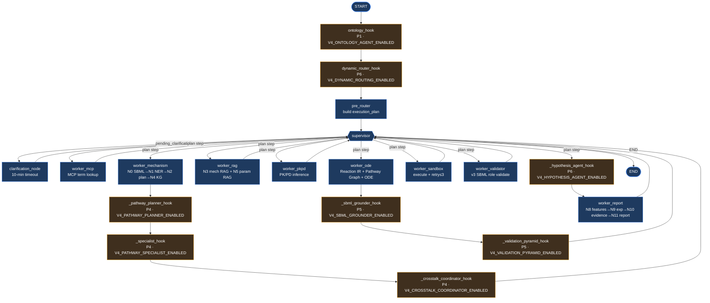

# BioDynamics Agent v4 RC — End-to-End UX Flow Audit & Redesign

> **Task D.1** — Documentation only. No source code changes.
> Scope: trace the real end-to-end pipeline in `backend/app/graph_v3.py` + the
> `frontend/` Workbench, document node-by-node data flow, flag redundancies,
> loops, and UX gaps, and map the system to a real researcher workflow.

---

## 1. Overview

BioDynamics Agent v4 RC is a Supervisor–Worker LangGraph pipeline that turns a
free-text biological hypothesis into a calibrated, validated ODE simulation and
a falsifiable follow-up experiment plan. The user types a question in the
front-end Workbench (Next.js + Zustand), the request streams to the FastAPI
backend as Server-Sent Events (SSE), and a Supervisor node walks an
`execution_plan` of v3 Workers (`worker_mcp` → `worker_mechanism` →
`worker_rag` → `worker_pkpd` → `worker_ode` → `worker_sandbox` →
`worker_validator` → `worker_report`). On top of that v3 spine, six v4 hook
chains are wired in *non-invasively* behind feature flags: **Ontology** (P1),
**Dynamic Router** (P6), **Pathway Planner → Specialist → Cross-talk** (P4,
after `worker_mechanism`), **SBML Grounder → Validation Pyramid** (P5, after
`worker_ode`), and **Hypothesis Agent** (P6, before `worker_report`). Every v4
hook returns `{}` when its flag is off, so the system degrades bit-for-bit to
v3. The front-end is a 4-pane Workbench (Project / Scientific Workspace /
Validation / collapsible AI Assistant) that consumes SSE events and hydrates a
Zustand store (`useWorkbenchStore`).

---

## 2. Complete Flow Diagram

### 2.1 Backend LangGraph topology (`graph_v3.py::build_workflow_v3`)



### 2.2 User journey (high level)

```
User → Input hypothesis (chat / pathway card)
     → Ontology Grounding (P1)
     → Pathway Recognition (P4 Planner + Specialist + Cross-talk)
     → Reaction Graph (P2 IR v2) + Knowledge Graph (v3 N4)
     → Simulation (v3 sandbox, retry≤3)
     → Validation (P5 Pyramid L1–L5 + v3 SBML validator)
     → Hypothesis Refinement (P6 Hypothesis Agent, ONE-SHOT — no loop)
     → Experiment Suggestion (v3 N9 + P6 experiment_design)
     → Export Report (v3 N11 markdown)
```

### 2.3 Frontend panes → backend state

```
┌──────────────────────┬─────────────────────────────┬───────────────────────┬──────────────────┐
│ Project / Pathway    │ Scientific Workspace        │ Validation            │ AI Assistant     │
│ (250px)              │ (Pathway Graph + Sim Tabs   │ (Pyramid + Hypothesis │ (collapsible     │
│                      │  + Param Editor)            │  + Evidence)          │  360px → 0)      │
├──────────────────────┼─────────────────────────────┼───────────────────────┼──────────────────┤
│ RunControls          │ PlaceholderPanel            │ PlaceholderPanel      │ AIAssistantPanel │
│  · mode picker       │  · Pathway Graph (C.3)      │  · Validation Pyramid │  · chat messages │
│  · manual modules    │  · Simulation Tabs (C.4)    │  · Hypothesis (C.8)   │  · SSE streaming │
│ Pathway Tree (C.2)   │  · Parameter Editor (C.5)   │  · Evidence & Warnings│  · clarification │
│ Benchmarks (C.12)    │                             │                       │  · agent tracker │
│ History (C.11)       │                             │                       │                  │
└──────────────────────┴─────────────────────────────┴───────────────────────┴──────────────────┘
       ← useWorkbenchStore (Zustand) ← streamChat() SSE ← /api/chat ← LangGraph ←
```

---

## 3. Node-by-Node Detail

The table below covers every node in `build_workflow_v3()`. "Gate" = feature
flag that must be `true` for the node to do work (all v4 hooks return `{}` when
their flag is `false`, leaving v3 behaviour untouched). "UI" = which Workbench
pane or `Message.type` reflects the output. "SSE" = events streamed to the
front-end `ingestSSEEvent` switch in `frontend/lib/store.ts`.

| # | Node (graph_v3) | Input (state fields consumed) | Output (state fields produced) | UI reflection | SSE events | Error handling | Gate |
|---|---|---|---|---|---|---|---|
| 1 | `ontology_hook` (P1) | `user_input`, `entities` (v3 NER, optional) | `v4_ontology_entities`, `v4_state.ontology.entities` | (no dedicated panel yet — C.2/C.3 TODO) | none directly (state only) | per-entity try/except → `verified=false`; hook-level try/except → `{}` | `V4_ONTOLOGY_AGENT_ENABLED` |
| 2 | `_dynamic_router_hook` (P6) | `v4_pathway_class`, all v4 fields (read-only) | `v4_agent_dispatches`, `v4_state.router.dispatches` | AI Assistant → Agent Workflow Tracker | (re-uses each sub-agent's events) | per-agent `ImportError` → `{}` stub; FailSafeDispatcher 30s timeout + max_depth=10 + visited set | `V4_DYNAMIC_ROUTING_ENABLED` |
| 3 | `pre_router` | `mode`, `manual_modules`, `user_input` | `execution_plan`, `current_step=0`, resets 20+ v3 fields | AI Assistant → status line | `agent_dispatch` (pre_router in_progress/completed) | rule-based PKPD check first; LLM failure → keep rule result | — |
| 4 | `supervisor` | `execution_plan`, `current_step`, `pending_clarification`, `clarification_response`, `stop_requested` | `next_worker` or `pending_clarification` or END | (drives `workflow_v3_state`) | `workflow_v3_state` (current_node) | stop_requested → END; plan exhausted → END | — |
| 5 | `clarification_node` | `pending_clarification` (waits on asyncio.Event) | `clarification_response` (with `context`) | ClarificationDialog | `clarification_needed` → `clarification_resolved` | 10-min timeout (`_CLARIFICATION_TIMEOUT_SECONDS=600`) auto-cancels; stop_event → `stop_requested` | — |
| 6 | `worker_mcp` (`_run_worker_mcp`) | `user_input` | `mcp_term_definitions`, `mcp_tool_calls`, `mcp_tokens_saved`, `mcp_rewritten_query` | AI Assistant → Term cards + MCP tool panel | `mcp_tool_call`, `mcp_term_definitions`, `token_usage` | Fast mode skips; otherwise delegates to `node0_mcp_term_lookup` | — |
| 7 | `worker_mechanism` | `user_input`, `sbml_model_id` | `entities`, `mechanism`, `knowledge_graph`, `network_json`, `network_relations`, `sbml_*` | AI Assistant → knowledge_graph card | `knowledge_graph`, `agent_dispatch` | N0 SBML loader fail-safe; N1/N2/N4 chained; `_normalize_network_json` | — |
| 8 | `_pathway_planner_hook` (P4) | `user_input` | `v4_pathway_class`, `v4_pathway_graph` (preliminary), `v4_state.pathway_class` | Project/Pathway pane (C.2 TODO) | none directly | rule match first; LLM fallback → `"UNKNOWN"`; hook-level → `{}` | `V4_PATHWAY_PLANNER_ENABLED` |
| 9 | `_specialist_hook` (P4) | `v4_pathway_class`, `v4_pathway_graph` | `v4_specialist_outputs`, `v4_state.specialist.outputs` | (no panel yet — C.3 TODO) | none directly | per-specialist import try/except; per-`apply_*` try/except; hook-level → `{}` | `V4_PATHWAY_SPECIALIST_ENABLED` (implies Planner) |
| 10 | `_crosstalk_coordinator_hook` (P4) | `v4_pathway_class`, `v4_specialist_outputs`, `v4_pathway_graph` | `v4_crosstalk_edges`, `v4_shared_species`, `v4_shared_species_sync`, `v4_time_scale_alignment`, `v4_state.specialist.*` | (no panel yet — C.3 TODO) | none directly | single-pathway → empty lists; multi-pathway coordinate(); hook-level → `{}` | `V4_CROSSTALK_COORDINATOR_ENABLED` |
| 11 | `worker_rag` (`_run_worker_rag`) | `knowledge_graph`, `user_input`, `mcp_rewritten_query` | `parameters`, `rag_retrieved_params`, `rag_selected_params`, `rag_fallback`, `rag_summary`, `rag_hit_rate`, `rag_insights`, `drug_candidates` | AI Assistant → RAG Insight panel | `rag_insights`, `rag_ready`, `rag_online_fallback` | Fast mode → `FAST_MODE_ESTIMATED` placeholders; Standard → N3+N5 | — |
| 12 | `worker_pkpd` | `user_input`, `drug_candidates`, `knowledge_graph` | `pkpd_profile`, `drug_regimen`, `combination_index`, `synergy_assessment` | AI Assistant → PK/PD card + synergy card | `pkpd_profile`, `drug_regimen`, `combination_synergy` | Fast mode skips; `node1_6_pkpd_inference` handles no-drug case | — |
| 13 | `worker_ode` | `network_json`, `parameters`, `mechanism`, `clarification_response`, `v4_ontology_entities`, `v4_reaction_ir` | `ode_model` (template+code), `reaction_graph`, `template_selection`, `v4_reaction_ir`, `v4_pathway_graph`, `v4_ode_system`, `v4_state.reaction_ir/pathway_graph` | AI Assistant → code block; Scientific Workspace → Param Editor | `code_generated`, `rule_violations`, `agent_dispatch` | `_reaction_ir_v2_hook` / `_pathway_graph_hook` / `_ode_template_v2_hook` each fail-safe to None | `V4_REACTION_IR_ENABLED`, `V4_PATHWAY_GRAPH_ENABLED`, `V4_ODE_TEMPLATE_V2_ENABLED` (independent) |
| 14 | `_sbml_grounder_hook` (P5) | `v4_ode_system`, `v4_reaction_ir`, `sbml_model_id`, `sbml_model_text`, `parameters`, `v4_ontology_entities` | `v4_grounding_ledger`, `v4_state.grounding.ledger` | (no panel yet — C.7 TODO) | none directly | missing SBML → warning + partial ledger; exception → fallback ledger `integrity=false` | `V4_SBML_GROUNDER_ENABLED` |
| 15 | `_validation_pyramid_hook` (P5) | `v4_ode_system`, `v4_reaction_ir`, `v4_pathway_graph`, `v4_pathway_class`, `sbml_model_id`, `v4_crosstalk_edges`, `v4_shared_species`, `metrics`, `v4_hypothesis_list` | `v4_validation_report` (level1–5 + overall_pass + failed_levels), `v4_state.validation.report`, `pending_clarification` (on fail) | Validation pane → Validation Pyramid (C.7 TODO) | (state only; `pending_clarification` triggers `clarification_needed`) | per-level try/except → `pass=false`; Level 4 no-metrics → `skipped pass=true`; overall_fail → clarification | `V4_VALIDATION_PYRAMID_ENABLED` |
| 16 | `worker_sandbox` | `ode_model.code`, `mode` | `execution_result`, `simulation_csv_path`, `image_base64`, `error_class`, `retry_count`, `dose_response_data`, `ic50`, `ic90`, `hed`, `simulation_ci`, `sandbox_failure_reason` | AI Assistant → execution log + image; Scientific Workspace → Sim Tabs | `execution_log`, `image_ready`, `simulation_csv`, `dose_response` | retry ≤ `_MAX_SANDBOX_RETRIES` (1 fast / 3 std); `node4_audit_and_correct` + `n6_ode_generator` rewrite | — |
| 17 | `worker_validator` (v3) | `user_input`, `simulation_csv_path`, `sbml_model_id`, `sbml_model_text`, `ode_model.template` | `sbml_role`, `validation_report` (error_diff, peak_time_diff, amplification_diff, structural_confidence_score, pass) | (rolled into report) | (state only) | `SBML_ROLE_NONE` → skip `pass=true`; libroadrunner missing → Track B structural score; exception → `pass=true` (non-blocking) | — |
| 18 | `_hypothesis_agent_hook` (P6) | `metrics`, `feature_metadata`, `v4_validation_report`, `v4_grounding_ledger`, `v4_sensitivity_report`, `v4_pathway_class` | `v4_hypothesis_list`, `v4_hypothesis_generated=true`, `v4_state.hypothesis.list/generated` | Validation pane → Hypothesis Panel (C.8 TODO) | `v4_hypothesis_list`, `v4_hypothesis_generated` | Validation fail → short-circuit empty list; generator fail → empty list; per-hyp literature search fail → keep empty pmids | `V4_HYPOTHESIS_AGENT_ENABLED` |
| 19 | `worker_report` | all prior state | `metrics`, `feature_metadata`, `confidence`, `experiment_protocols`, `paper_evidence`, `report`, `final_report` | AI Assistant → report card | `metrics`, `experiment_protocols`, `paper_evidence`, `report`, `report_ready`, `token_usage`, `end` | Fast mode skips N9/N10; N11 template render; compress_worker_output | — |

> **Note on Calibration & Sensitivity (P5 Task 5.7/5.8):** both
> `calibration_hook_node` (`backend/app/calibration/calibration_agent.py`) and
> `sensitivity_hook_node` (`backend/app/sensitivity/sensitivity_analyzer.py`)
> are **fully implemented but NOT wired into `build_workflow_v3()`**. They are
> reachable only via the Dynamic Router's `execute_agent("calibration"/...)`
> path, which itself is gated behind `V4_DYNAMIC_ROUTING_ENABLED`. See
> §7 Gap G3.

---

## 4. Redundancy Analysis

### R1 — Ontology Agent runs twice when Dynamic Router is on  ⚠️ **HIGH**

When `V4_DYNAMIC_ROUTING_ENABLED=true`, the Dynamic Router's
`build_dispatch_plan()` (`backend/app/agent_orchestration/dynamic_router.py`)
**always** includes `"ontology"` in the core agent list, and `execute_agent`
lazily imports and calls `ontology_hook_node(state)` a second time. The same
state (`user_input`, `entities`) is re-annotated, doubling HGNC/UniProt/ChEBI
API traffic and writing the same `v4_ontology_entities` field that the graph
node `ontology_hook` already wrote one step earlier.

**Same pattern affects:** `pathway_planner`, `pathway_specialist_group`,
`reaction_builder` (re-runs P2 IR build that `worker_ode._reaction_ir_v2_hook`
already did), `validation` (re-runs the P5 pyramid that
`_validation_pyramid_hook` will run again after `worker_ode`),
`crosstalk_coordinator`, `sbml_grounder`, `hypothesis`. The Dynamic Router was
designed as an *alternative* orchestration path (P6 Task 6.5), but because it
is wired as a graph node **before** `pre_router` (line 1484), it executes
**in addition to** the dedicated hook nodes, not instead of them.

**Recommendation:** either (a) gate the dedicated hook nodes off when
`V4_DYNAMIC_ROUTING_ENABLED=true` (let the router own v4 orchestration), or
(b) strip `ontology/pathway_planner/pathway_specialist_group/reaction_builder/
validation/crosstalk_coordinator/sbml_grounder/hypothesis` from
`build_dispatch_plan()` since the graph already runs them. Option (b) is the
smaller diff and is recommended for RC.

### R2 — v3 `worker_validator` overlaps v4 Level 2 SBML validator  ⚠️ **MEDIUM**

`worker_validator` (graph node, always runs in the plan) calls
`get_sbml_validator().validate(...)` and produces `validation_report`
(error_diff / peak_time_diff / amplification_diff / structural_confidence_score).
The v4 `_validation_pyramid_hook` then runs `Level2SBMLValidator` which, per
`validation_agent.py`, also does "Track A roadrunner / Track B structural
similarity / skipped" against the same SBML. Two SBML comparisons run on the
same `simulation_csv_path` + `sbml_model_text`.

**Recommendation:** when `V4_VALIDATION_PYRAMID_ENABLED=true`, have
`worker_validator` short-circuit to the skipped branch and let Level 2 own SBML
comparison. The v3 `validation_report` field can be populated from
`v4_validation_report.level2` for backward compatibility.

### R3 — Reaction IR built twice (graph hook + Dynamic Router)  ⚠️ **MEDIUM**

`worker_ode._reaction_ir_v2_hook` builds `v4_reaction_ir` from `network_json`
via `registry.safe_v3_to_v4(...)`. When the Dynamic Router is on, it also
dispatches `reaction_builder` → `build_from_pathway_graph` (per
`_get_class_name` mapping). The second build overwrites the first with the same
content. Same root cause as R1.

### R4 — Knowledge graph assembled inline in `worker_mechanism`  ℹ️ **LOW**

`worker_mechanism` manually re-builds `network_json` from
`knowledge_graph.nodes/edges` (lines 683–691 of `graph_v3.py`) even though
`_normalize_network_json` exists in `nodes.py` for the same job. The inline
copy also defaults `interaction` to `"activation"` (TODO P2-6 comment), which
masks `inhibition` edges. Not a duplicate *node*, but a duplicate *code path*.

**Recommendation:** call `_normalize_network_json` directly (the TODO already
says so). Out of scope for D.1 but flagged for the backlog.

### R5 — `pre_router` resets 20+ state fields defensively  ℹ️ **LOW (by design)**

`pre_router` explicitly empties `network_json`, `parameters`, `ode_model`,
`metrics`, etc. on every request (lines 246–271). This is intentional
"defence in depth" against cross-request state leakage in the MemorySaver
checkpointer, not a true redundancy, but it does mean any v4 field that *isn't*
in the reset list (e.g. `v4_ontology_entities`, `v4_pathway_class`) can leak
across threads. Worth a follow-up to add the v4 fields to the reset list.

---

## 5. Loop Analysis

### 5.1 Is there a Hypothesis Refinement loop?  ❌ **No.**

The task brief asks whether `hypothesis_agent.py` or the router creates a loop
back to earlier nodes. Reading `build_workflow_v3()` (lines 1439–1534) and
`HypothesisAgent.generate()` (`hypothesis_agent.py`):

- `_hypothesis_agent_hook` is a **single forward node** inserted between
  `supervisor` and `worker_report` (line 1500 + 1507). It runs once, writes
  `v4_hypothesis_list`, and hands off to `worker_report`. There is **no edge
  back** to `worker_mechanism`, `worker_ode`, or `supervisor` from the
  hypothesis hook.
- `HypothesisAgent.generate()` is a pure function of its inputs
  (`metrics`, `feature_metadata`, `v4_validation_report`, `v4_sensitivity_report`,
  `v4_pathway_class`). It does not re-invoke any upstream node and does not
  re-queue itself.
- The Dynamic Router's `FailSafeDispatcher` has `max_depth=10` and a `visited`
  set (per `dynamic_router.py` docstring), so even the router's internal agent
  dispatch cannot loop infinitely — but it is a single dispatch pass, not a
  refinement loop.

**Conclusion:** the "Hypothesis Refinement loop" described in the spec
(spec.md Part 5) is **not implemented**. Hypotheses are generated one-shot from
the final simulation metrics and never re-simulated, re-validated, or pruned
against new evidence.

### 5.2 Existing loop-like constructs (all bounded)

| Construct | Bound | Location |
|---|---|---|
| Supervisor ↔ Worker cycle | `current_step < len(execution_plan)` then END | `supervisor` + `_advance_step` |
| `clarification_node` wait | 600 s timeout (`_CLARIFICATION_TIMEOUT_SECONDS`) | `clarification_node` |
| `worker_sandbox` retry | 1 (fast) / 3 (standard, manual) — `_MAX_SANDBOX_RETRIES` | `worker_sandbox` |
| Dynamic Router agent dispatch | `max_depth=10`, 30 s timeout, visited set | `FailSafeDispatcher` |

None of these are *hypothesis* refinement loops; they are bounded control-flow
guards.

### 5.3 Risk if a refinement loop is added without a guard

If a future task wires `hypothesis_agent_hook → worker_ode` (re-simulate with
the hypothesis's predicted parameter change) without a counter, the graph will
spin forever because LangGraph's `MemorySaver` checkpointer will keep replaying
the cycle. **A `max_iterations` guard is mandatory.**

### 5.4 Recommendation: add a bounded Hypothesis Refinement loop

```
hypothesis_agent_hook ──(iteration < 3 && confidence < threshold)──► worker_ode
        ▲                                                                  │
        └───────────────── worker_sandbox → validation ────────────────────┘
                                 (iteration += 1)
```

**Recommended `max_iterations = 3`.** Rationale:
- 1 iteration = baseline (current behaviour).
- 2nd iteration = re-simulate with the top hypothesis's predicted perturbation.
- 3rd iteration = refinement if confidence is still below threshold.
- >3 iterations burns LLM + sandbox budget without proportionate confidence
  gain, and the 600 s clarification timeout would already be at risk.

Guard implementation sketch (for the follow-up task, **not** this doc task):
add `v4_hypothesis_iterations: int` to `BioDynamicsState`, increment in
`_hypothesis_agent_hook`, and route back to `worker_ode` via a conditional edge
when `iterations < 3 AND v4_validation_report.overall_pass == False`. Hard-cap
at 3 to prevent runaway cost.

---

## 6. Researcher Workflow Mapping

The real-world researcher workflow (left) mapped to BioDynamics features
(right). Gaps marked ❌ are expanded in §7.

| Real-world step | BioDynamics feature | Node / Panel | Gap |
|---|---|---|---|
| 1. **Literature review** — read papers, gather known interactions | RAG retrieval (N3 mechanism RAG + N5 parameter RAG) + PubMed online fallback | `worker_rag` → AI Assistant RAG Insight panel | ❌ G4: no literature *import* — user cannot paste a PMID list to seed the KG |
| 2. **Hypothesis formation** — "I think EGFR→MAPK amplifies under dose X" | Free-text chat input + Pathway Selector home card | `frontend/app/page.tsx` PathwaySelector → `sendMessage` | ⚠️ G5: structured-hypothesis input exists (Task C.6) but doesn't pre-fill `v4_pathway_class` |
| 3. **Modeling** — draw mechanism, pick kinetics | KG build (N4) + Reaction IR (P2) + Pathway Specialist templates (P4) | `worker_mechanism` → `_pathway_planner_hook` → `_specialist_hook` → Scientific Workspace Pathway Graph (C.3 placeholder) | ❌ G6: Pathway Graph panel is still a `PlaceholderPanel` (C.3) — no visual editing |
| 4. **Simulation** — solve ODEs, plot timecourses | `worker_sandbox` (execute_simulation_code_v2, retry≤3) | AI Assistant image_ready + Scientific Workspace Sim Tabs (C.4 placeholder) | ⚠️ G7: Sim Tabs is a placeholder; plots only render in the AI Assistant chat |
| 5. **Validation** — compare to BioModels, check mass conservation | v3 `worker_validator` + v4 Validation Pyramid L1–L5 | Validation pane → Validation Pyramid (C.7 placeholder) | ❌ R2 (dual SBML validation) + G8: pyramid panel is a placeholder |
| 6. **Calibration** — fit params to data | P5 CalibrationAgent (implemented) | **NOT WIRED** — only runs via Dynamic Router | ❌ G3: calibration never runs when router is off (default) |
| 7. **Sensitivity analysis** — which params matter | P5 SensitivityAnalyzer (local + Sobol + Morris) | **NOT WIRED** — only runs via Dynamic Router | ❌ G3: same as calibration |
| 8. **Hypothesis refinement** — iterate on the model | P6 HypothesisAgent (one-shot) | Validation pane → Hypothesis Panel (C.8 placeholder) | ❌ G1: no refinement loop (see §5) |
| 9. **Experiment design** — propose wet-lab validation | v3 N9 experiment_protocols + P6 `experiment_design` field | AI Assistant experiment_protocols card | ⚠️ G9: P6 `experiment_design` is only filled if `experiment_designer` is injected (Task 6.2 not implemented → field stays empty) |
| 10. **Publication** — export figures + report | v3 N11 `final_report` markdown + `report_ready` SSE | AI Assistant report card | ⚠️ G10: no PDF/DOCX export, no figure download — markdown only |

---

## 7. Gaps & Recommendations

### G1 — No Hypothesis Refinement loop  ❌ **HIGH** (see §5)
Hypotheses are generated one-shot. The spec (Part 5) describes an iterative
refinement against simulation, but the code has no back-edge. **Recommendation:**
wire a bounded refinement loop (`max_iterations=3`) from
`_hypothesis_agent_hook` back to `worker_ode` when validation fails, with a
new `v4_hypothesis_iterations` counter in state.

### G2 — Calibration & Sensitivity never run by default  ❌ **HIGH**
`calibration_hook_node` and `sensitivity_hook_node` are fully implemented
(`backend/app/calibration/calibration_agent.py`,
`backend/app/sensitivity/sensitivity_analyzer.py`) but **not added as nodes in
`build_workflow_v3()`**. They are only reachable through the Dynamic Router,
which is itself gated behind `V4_DYNAMIC_ROUTING_ENABLED` (default false). With
the router off, `v4_calibration_result` and `v4_sensitivity_report` are always
empty, so `HypothesisAgent` receives no sensitivity input and
`v4_validation_report.level4` cannot use calibrated params. **Recommendation:**
add `calibration_hook_node` and `sensitivity_hook_node` as a P5 hook chain
after `_validation_pyramid_hook` (or before it, since Level 4 benchmark may
want calibrated params), mirroring the P4/P5 hook wiring pattern. Each already
self-gates on its own flag.

### G3 — Dynamic Router duplicates work (see R1)  ❌ **HIGH**
When `V4_DYNAMIC_ROUTING_ENABLED=true`, the router re-executes 8 agents that
the graph already runs as dedicated nodes. **Recommendation:** strip the
duplicated agents from `build_dispatch_plan()` and keep only the 4 P6 stubs
(`mechanism_builder`, `ode_builder`, `simulation_planner`, `parameter_agent`)
plus any agent not yet wired as a graph node (currently calibration +
sensitivity, which G2 would also fix).

### G4 — No literature import / PMID seeding  ⚠️ **MEDIUM**
A researcher typically arrives with a known PMID list. The chat only accepts
free text. **Recommendation:** add a "Seed from PMIDs" control in the Project
pane that pre-fills `v4_ontology_entities` and biases `worker_rag` retrieval.

### G5 — Structured Hypothesis input (C.6) doesn't drive `v4_pathway_class`
The multi-mode input area (Task C.6) lets users pick a pathway, but
`sendMessage` in `store.ts` only sends `user_input` + `mode` + `manual_modules`
to `/api/chat`. The selected pathway is not forwarded, so
`_pathway_planner_hook` re-derives it from free text. **Recommendation:** add
`selected_pathway` to the `/api/chat` payload and have `pre_router` seed
`v4_pathway_class` when present.

### G6 — Three of four center-pane panels are placeholders
Pathway Graph (C.3), Simulation Tabs (C.4), Parameter Editor (C.5) are all
`PlaceholderPanel` in `WorkbenchShell.tsx`. The actual simulation image only
lands in the AI Assistant chat via `image_ready`. **Recommendation:** wire
`v4_pathway_graph` SSE → Pathway Graph panel, `simulation_csv` → Sim Tabs, and
`parameters` → Parameter Editor. The store already has `pathwayGraph` /
`simulationResult` slots with TODO comments (store.ts lines 811–815).

### G7 — v4 SSE events `v4_validation_report` / `v4_pathway_graph` / `v4_simulation_result` are no-ops
`ingestSSEEvent` (store.ts lines 811–815) has a TODO for these three events.
They are received but discarded, so the Validation Pyramid and Pathway Graph
panels cannot hydrate even after the panels are built. **Recommendation:** add
`setValidationReport` / `setPathwayGraph` / `setSimulationResult` actions and
wire them in the switch.

### G8 — v4 fields not in `pre_router` reset list  ⚠️ **LOW**
`pre_router` resets 20+ v3 fields per request but no `v4_*` fields. With the
MemorySaver checkpointer, `v4_ontology_entities` / `v4_pathway_class` /
`v4_hypothesis_list` etc. can leak across threads. **Recommendation:** add a
`reset_v4_state()` helper that empties all 17 `v4_` flat fields +
`v4_state`, and call it from `pre_router` next to the v3 resets.

### G9 — P6 ExperimentPlanner / FalsificationChecker / ParameterExplorer stubs
`HypothesisAgent.__init__` accepts `experiment_designer`,
`falsifiability_checker`, `parameter_explorer` injectables, but the hook node
instantiates `HypothesisAgent()` with no args, so all three are `None`. The
`experiment_design` / `falsification_criteria` / `parameter_robustness` fields
stay empty on every hypothesis. **Recommendation:** implement Task 6.2/6.3/6.4
or drop the empty fields from the hypothesis schema to avoid misleading the UI.

### G10 — No export beyond markdown
`final_report` is markdown rendered in the AI Assistant chat. Researchers need
PDF/DOCX with figures. **Recommendation:** add an "Export" button in the
Project pane that calls `/api/report/export?format=pdf` and bundles
`final_report` + `image_base64` + `v4_validation_report`.

---

## 8. Quick-reference: Feature flag → node matrix

| Flag (default) | Node(s) gated | Effect when off |
|---|---|---|
| `V4_ONTOLOGY_AGENT_ENABLED` (false) | `ontology_hook` | returns `{}`; v3 NER only |
| `V4_DYNAMIC_ROUTING_ENABLED` (false) | `_dynamic_router_hook` | returns `{}`; no 13-agent dispatch |
| `V4_PATHWAY_PLANNER_ENABLED` (false) | `_pathway_planner_hook` | returns `{}`; `v4_pathway_class` empty |
| `V4_PATHWAY_SPECIALIST_ENABLED` (false) | `_specialist_hook` | returns `{}`; no specialist templates |
| `V4_CROSSTALK_COORDINATOR_ENABLED` (false) | `_crosstalk_coordinator_hook` | returns `{}`; single-pathway only |
| `V4_REACTION_IR_ENABLED` (false) | `worker_ode._reaction_ir_v2_hook` | returns None; v3 `network_json` only |
| `V4_PATHWAY_GRAPH_ENABLED` (false) | `worker_ode._pathway_graph_hook` | returns None; no `v4_pathway_graph` |
| `V4_ODE_TEMPLATE_V2_ENABLED` (false) | `worker_ode._ode_template_v2_hook` | returns None; v3 `ode_templates/` |
| `V4_SBML_GROUNDER_ENABLED` (false) | `_sbml_grounder_hook` | returns `{}`; no 5-level mapping ledger |
| `V4_VALIDATION_PYRAMID_ENABLED` (false) | `_validation_pyramid_hook` | returns `{}`; v3 `worker_validator` only |
| `V4_HYPOTHESIS_AGENT_ENABLED` (false) | `_hypothesis_agent_hook` | returns `{}`; no `v4_hypothesis_list` |
| `V4_CALIBRATION_AGENT_ENABLED` (false) | `calibration_hook_node` + `sensitivity_hook_node` **(NOT in graph)** | never runs unless router on |

---

*End of UX_FLOW.md — Task D.1.*
